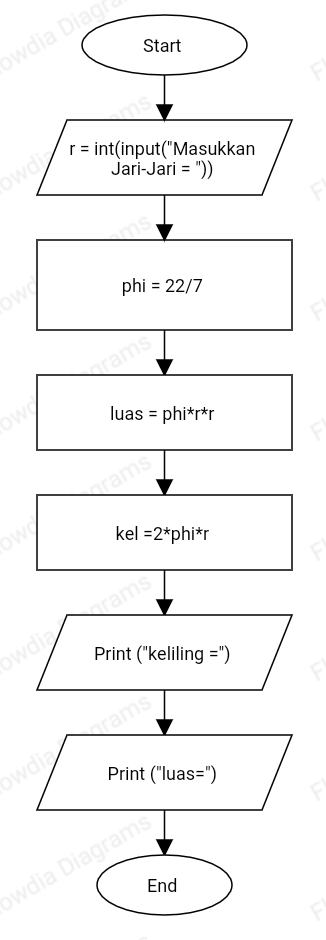
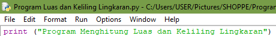
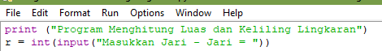
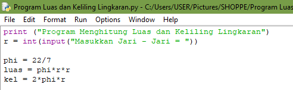
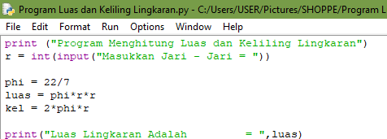
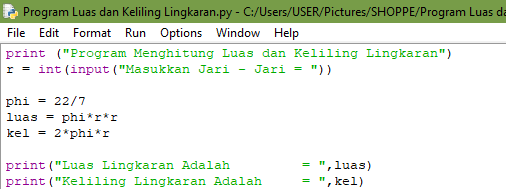
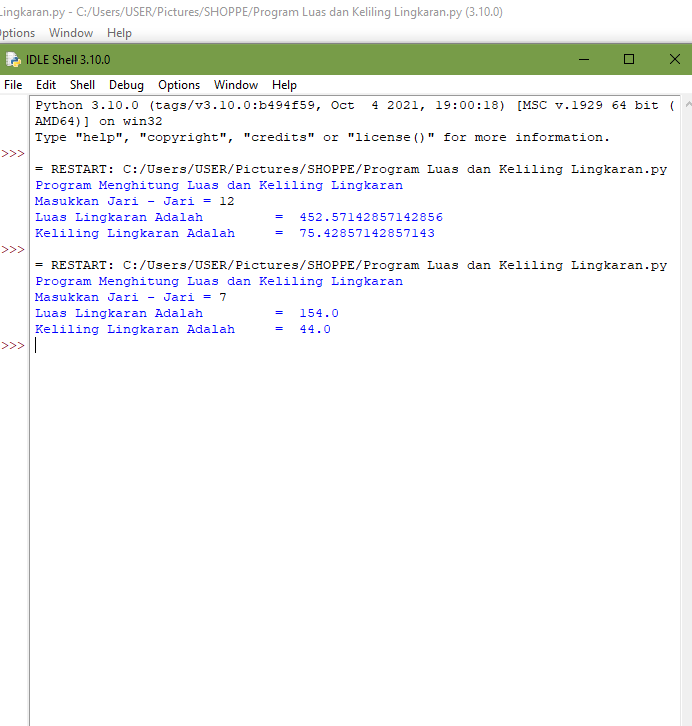

# Latihan Program Menghitung Luas dan Keliling Lingkaran
Latihan menghitung luas dan keliling lingkaran python
## FlowChart

### Perintah program
1.Perintah untuk menambahkan judul tugas, print ("Program Menghitung Luas dan Keliling Lingkaran")

2.Perintah input jari-jari, r = int(input("Masukkan Jari -Jari ="))

3.Perintah untuk phi,luas,kel. phi = 22/7, luas = phi*r*r, kel = 2*phi*r

4.Perintah hasil luas lingkaran, print ("Luas Lingkaran Adalah =,luas)

5.Perintah hasil keliling lingkaran, print ("Keliling Lingkaran Adala =,kel)

6.Simpan hasil program (CTRL+S)

7.Jalankan hasil program (F5)

8.Jika program sudah berhasil dijalankan, masukkan jari-jari dibagian masukkam jari - jari sebagai contoh pertama 12 enter maka akan di dapatkan hasil luas = 452,5 keliling = 75,4. contoh kedua jari-jari = 7 maka luas = 154.0 dan keliling 44.0

Terimakasih...